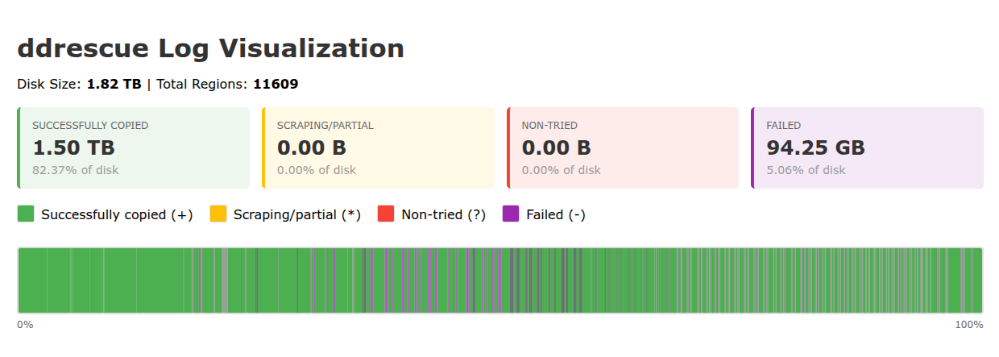
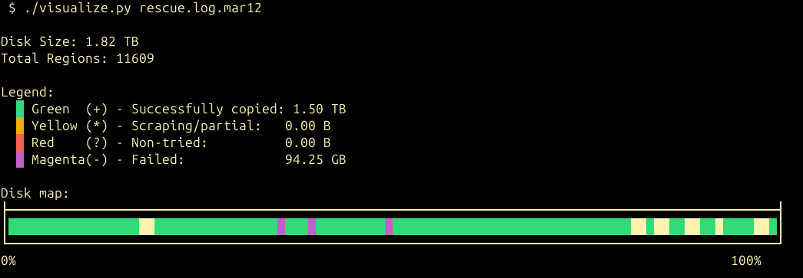

# ddrescue Log Visualizer

A tool to visualize GNU ddrescue mapfiles as horizontal bar charts with color-coded regions.





## Features

- **Terminal output**: Color-coded ASCII visualization
- **PNG export**: Generate static image files
- **Interactive HTML**: Hover over regions for detailed tooltips showing position, size, and status

## Status Colors

- **Green** (+): Successfully copied
- **Yellow** (*): Scraping/partial recovery
- **Red** (?): Non-tried regions
- **Magenta** (-): Failed regions

## Usage

### Terminal Output
```bash
./visualize.py rescue.log
```

### Generate PNG
```bash
./visualize.py rescue.log --png output.png
```

### Generate Interactive HTML
```bash
./visualize.py rescue.log --html output.html
```

### Generate Both
```bash
./visualize.py rescue.log --png --html
```

### Custom Terminal Width
```bash
./visualize.py rescue.log --width 150
```

## Requirements

- Python 3.6+
- For PNG output: `pip install Pillow`

## Example Output

The tool shows:
- Total disk size
- Number of regions
- Statistics for each status type
- Visual bar chart representation
- Percentage completion

For the HTML output, hover over any region to see detailed information including exact position and size.

## Companion script: `power_cycle_drive.py`

When ddrescue gets stuck on a flaky drive, sometimes the only way to make progress is to power-cycle the drive and let the SCSI bus rediscover it. `power_cycle_drive.py` is the script I use for this on my own setup: it toggles a Home Assistant relay, triggers a SCSI rescan, and waits for the device to reappear.

It is intentionally a personal-setup example rather than a generic tool — the Home Assistant URL, relay entity ID, SCSI host number, and target device path are hardcoded at the top of `main()`. Edit those for your own environment, and set `HASS_LLAC` to a Home Assistant long-lived access token.

## License

MIT — see [LICENSE](LICENSE).
